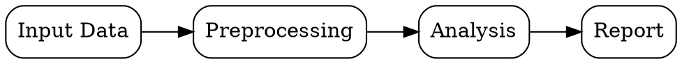

---
# Title displayed as the main heading of the landing page.
title: "My Documentation"
# Subtitle shown below the title.
subtitle: "SDBS-managed Quarto project"
# Automatically updated to the last-modified date from git.
# Default output format for this document.
# Supported values: html, pdf, docx, beamer, revealjs, etc.
# Multiple formats can be specified as a list: [html, pdf]
format: html
# metadata-files:
#   - ./_include/author.yml
abstract: |
  Replace this placeholder with your project documentation abstract.
  This is displayed at the top of the page and in search results.
---

## Getting Started

This template serves as a starting point for SDBS-managed Quarto projects.
Each `.qmd` file in this directory with a YAML frontmatter block becomes a
build target. The build system handles dependencies, caching, and parallel
rendering automatically.

### Adding Documents

Create `.qmd` files in this directory. Each file with a YAML frontmatter block
becomes a build target. Use the `_include/` directory for shared fragments.

### Sample Visualization (DOT)

The following code block shows a sample DOT graph for illustration purposes.
To render it with Graphviz in a Quarto Python block, use the `dot()` helper
from `_include/_graphviz.py` (available in the advanced template).



### Building Locally

Use the `sdb` CLI to build all targets. The build system detects which files
have changed and re-renders only the affected documents.

```bash
# Build all targets
sdb build .

# Build with website profile (parallel rendering)
sdb build . --website -j 4

# Build a single target
sdb build ./my_document.qmd
```

```bash
# Check for broken links and missing citations
sdb check .
```

### Build Configuration

Build parameters are externalized in a YAML configuration file (`build.yml`)
placed at the project root. The following example shows common settings.

```yaml
# build.yml — SDBS build configuration
targets:
  - path: "*.qmd"
    exclude:
      - "_draft*"
    format: html
  - path: "research/*.qmd"
    format:
      - html
      - pdf
    pdf:
      toc: true
      number-sections: true

website:
  output-dir: "_site"
  site-url: "https://example.com/docs"

cache:
  enabled: true
  directory: ".sdb_cache"

parallel:
  jobs: 4
  strategy: "cpu-count"

profiles:
  local:
    clean-output: true
  ci:
    clean-output: false
    check-links: true
    check-citations: true
```

### Build System Key Features

- **Parallel rendering**: Multiple Quarto documents are rendered concurrently,
  using physical CPU cores for optimal performance.
- **Intelligent caching**: Each document's hash (including all dependencies)
  determines whether a rebuild is needed; modifying an included fragment
  triggers rebuilds only for documents that actually include it.
- **External configuration**: Build parameters are externalized in a YAML
  configuration file (`build.yml`), allowing target-specific overrides and
  exclusion patterns without modifying the build script.
- **Website-mode isolation**: For website profiles, each target is rendered in
  a fully isolated temporary directory, preventing resource conflicts and
  enabling true parallel website generation.
- **Multi-format output**: Each target can be rendered to multiple formats
  (html, pdf, docx) in a single build pass, with format-specific overrides.
- **Profile-based builds**: Define `local`, `ci`, or custom profiles to
  control caching, link checking, and output cleaning per environment.

---

<details>
<summary>Click to expand for full build guide</summary>

## Build Guide

SDBS (SSCCS Documentation Build System) orchestrates Quarto renders with
intelligent caching and parallelism, enabling fast, reproducible builds of
multi-format outputs. It is designed to handle complex documentation projects
with many interdependent files while minimizing redundant work.

### Environment Setup (Recommended)

Clone the SDBS repository and use the provided Docker environment for a
reproducible build state:

```bash
git clone https://github.com/ssccsorg/sdbs.git
cd sdbs
docker build -t sdbs .
docker run --rm -v $(pwd)/docs:/workspace/docs sdbs
```

### Local Build (Without Docker)

```bash
git clone https://github.com/ssccsorg/sdbs.git
cd sdbs
pip install .
sdbs-build /path/to/docs
```

### Quick Start

```bash
sdbs-build /path/to/docs           # generate all targets for local use
sdbs-build /path/to/docs --website  # generate website-optimized outputs
```

For other usage examples and a complete description of the system, see the
[SDBS repository](https://github.com/ssccsorg/sdbs).

### Docs Checker

SDBS includes a documentation validation tool (see the SDBS repository for
CLI usage):

- Links (local/remote, YAML frontmatter, BibTeX)
- Citations: reports if `@key` is missing from `.bib`, or if `.bib` is
  completely unused

</details>
